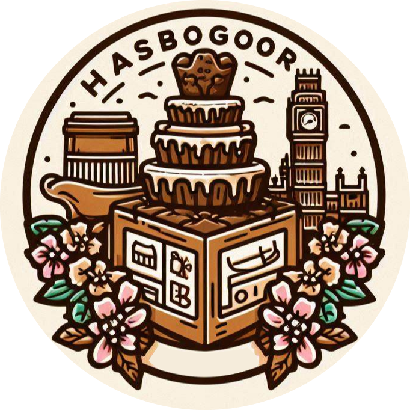

# <h1 align="center">HasBogor</h1>

     <!-- Atur ukuran sesuai kebutuhan -->

## Anggota Kelompok
- **Akmal Nabil Fikri** - 2306152084
- **Rebecca Zaneta Octoria Hutajulu** - 2306275065
- **Michael Ignasius** - 2306259950
- **Ivan Jehuda Angi** - 2306152222
- **Ismail Yanuar Anwas** - 2306245781
- **Widya Mutia Ichsan** - 2306165912

## Table of Contents
- [Deskripsi Aplikasi](#deskripsi-aplikasi)
- [Daftar Modul yang Akan Diimplementasikan](#daftar-modul-yang-akan-diimplementasikan)
- [Sumber Initial Dataset Kategori Utama Produk](#sumber-initial-dataset-kategori-utama-produk)
- [Promo](#promo)
- [Role atau Peran Pengguna Beserta Deskripsinya](#role-atau-peran-pengguna-beserta-deskripsinya)
- [Desain dan Struktur Aplikasi](#desain-dan-struktur-aplikasi)
  - [USER](#USER)
  - [ADMIN](#admin)

## Deskripsi Aplikasi
**HasBogor** adalah aplikasi web yang bertujuan untuk memenuhi kebutuhan wisatawan dan masyarakat dalam menemukan produk oleh-oleh khas Bogor dengan lebih mudah dan efisien. Aplikasi ini menyediakan pusat informasi dan transaksi untuk oleh-oleh khas Bogor, termasuk makanan khas, kerajinan tangan, dan banyak lagi. Pengguna dapat memesan produk secara online serta berinteraksi dengan komunitas melalui ulasan dan rekomendasi produk.

### Kebermanfaatan Aplikasi
- Mendukung pengrajin lokal dalam menjual produk mereka.
- Meningkatkan akses wisatawan ke produk-produk khas Bogor.
- Mempermudah transaksi dan memperkaya pengalaman belanja oleh-oleh.

## Daftar Modul yang Akan Diimplementasikan
| **Modul**       | **Deskripsi**                                                                 |
|-----------------|-------------------------------------------------------------------------------|
| Autentikasi     | Mengelola login dan registrasi pengguna, termasuk pengelolaan password.       |
| Produk          | Menampilkan daftar produk, detail produk, dan fitur pencarian.               |
| Keranjang       | Mengelola produk yang ditambahkan ke keranjang dan proses checkout.           |
| Pembayaran      | Menangani proses pembayaran dan konfirmasi transaksi.                         |
| Ulasan          | Pengguna dapat memberikan ulasan dan rating pada produk.                     |
| Event           | Menampilkan acara lokal di Bogor.                                             |
| Kontak          | Form kontak untuk layanan pelanggan.                                          |
| Promo           | Mengolah dan menampilkan promo dan diskon.                                    |
| Rekomendasi     | Memberikan rekomendasi produk kepada pengguna.                                |

## Sumber Initial Dataset Kategori Utama Produk
Pada sumber dataset awal ini, kami mengumpulkan informasi melalui metode manua

| **Kategori Produk** | **Deskripsi**                                                               | **Sumber Data**            |
|---------------------|-----------------------------------------------------------------------------|----------------------------|
| Makanan             | Berbagai makanan khas Bogor seperti brownies, dodol, dan keripik.           | [Data manual](#data-manual-makanan)              |
| Souvenir            | Kerajinan tangan unik sebagai kenang-kenangan.                             |-              |

---
### Data Manual Makanan
| No | Nama Oleh-oleh              | Kategori        | Harga (Rp)          | Deskripsi                                                                 | Referensi                                                             |
|----|-----------------------------|-----------------|---------------------|---------------------------------------------------------------------------|----------------------------------------------------------------------|
| 1  | Asinan Bogor                | Makanan         | 25.000 - 50.000     | Campuran buah dan sayur dalam kuah asam manis pedas, khas Bogor         | [pergi kuliner](https://pergikuliner.com/restaurants/bogor/asinan-asli-bogor-bogor-tengah)       |
| 2  | Roti Unyil Venus            | Makanan         | 15.000 - 30.000     | Roti mini dengan berbagai varian rasa, populer sejak 1978                | [pergi kuliner](https://pergikuliner.com/restaurants/bogor/roti-unyil-venus-bogor-timur-3)       |
| 3  | Talas Bogor                 | Makanan         | 20.000 - 40.000     | Umbi-umbian khas Bogor yang diolah menjadi berbagai makanan              | [superkue](https://superkue.com/v2/?page=category&cat=6)            |
| 4  | Makaroni Ngehe             | Makanan Ringan  | 15.000 - 25.000     | Makaroni kering dengan bumbu pedas khas                                  | [pergi kuliner](https://pergikuliner.com/restaurants/makaroni-ngehe-tanah-sareal/menus)          |
| 5  | Lapis Talas Bogor           | Kue             | 50.000 - 100.000    | Kue lapis dengan campuran talas, lembut dan gurih                       | [superkue](https://superkue.com/v2/?page=category&cat=6)            |
| 6  | Dodol Talas                 | Makanan         | 30.000 - 60.000     | Makanan manis dan kenyal berbahan dasar talas                            | [lazada](https://www.lazada.co.id/tag/dodol-talas-bogor/)            |
| 7  | Pie Apel Bogor              | Kue             | 40.000 - 80.000     | Pie dengan isian apel segar, perpaduan manis dan asam                   | [pergikuliner](https://pergikuliner.com/restaurants/bogor/pia-apple-pie-bogor-tengah)            |
| 8  | Bolu Lapis Sangkuriang      | Kue             | 60.000 - 120.000    | Bolu berlapis dengan tekstur lembut dan rasa yang khas                  | [lapisbogor](https://lapisbogor.co.id/)                             |
| 9  | Kue Soes Merdeka            | Kue             | 30.000 - 50.000     | Kue sus dengan varian isi yang beragam                                   | [pergikuliner](https://pergikuliner.com/restaurants/soes-merdeka-bogor-utara/gallery/1417446)    |
| 10 | Keripik Talas               | Makanan Ringan  | 20.000 - 40.000     | Keripik renyah berbahan dasar talas                                      | [Tokopedia Blog](https://www.tokopedia.com/find/keripik-talas-bogor) |
| 11 | Tahu Susu Lembang           | Makanan         | 25.000 - 50.000     | Tahu dengan tekstur lembut dan rasa susu yang khas                      | [shopee](https://shopee.co.id/list/Tahu/Susu/Lembang)                |
| 12 | Brownies Kukus Amanda       | Kue             | 40.000 - 80.000     | Brownies kukus dengan berbagai varian rasa                               | [pergikuliner](https://pergikuliner.com/restaurants/bogor/amanda-brownies-kukus-bogor-utara)    |
| 13 | Bakso Aux                   | Makanan         | 30.000 - 60.000     | Bakso dengan tekstur kenyal dan rasa yang khas                          | [Gotravelly](https://gotravelly.com/blog/oleh-oleh-khas-bogor/)      |
| 14 | Cakwe Renata                | Makanan         | 15.000 - 30.000     | Cakwe dengan tekstur renyah dan bumbu khas                              | [gofood](https://gofood.co.id/jakarta/restaurant/cakwe-bogor-jambu-dua-3d2f417f-6c56-4c18-b542-f62a0f7179e9) |
| 15 | Emping Melinjo             | Makanan Ringan  | 20.000 - 40.000     | Keripik dari biji melinjo dengan rasa gurih khas                       | [bobobox blog](https://bobobox.com/blog/oleh-oleh-khas-bogor-yang-tahan-lama/)                   |
| 16 | Es Pala Bogor               | Minuman         | 10.000 - 20.000     | Minuman segar khas Bogor dengan ekstrak buah pala                       | [kuliner](https://rri.co.id/kuliner/651563/sensasi-manis-hangat-es-pala-bogor)                  |
| 17 | Pancake Durian D'Linow     | Kue             | 50.000 - 100.000    | Pancake dengan isian durian asli                                         | [pergikuliner](https://pergikuliner.com/restaurants/pancake-durian-d-dan-d-bogor-utara/menus)   |
| 18 | Kue Lapis Talas Sari       | Kue             | 60.000 - 120.000    | Kue lapis premium dengan campuran talas Bogor                           | [Jawa Pos](https://www.jawapos.com/jpg-today/01/353456/5-oleh-oleh-khas-bogor-yang-wajib-dibeli) |
| 19 | Brownis Talas               | Makanan         | 25.000 - 50.000     | Camilan manis khas yang menggabungkan cita rasa cokelat premium dengan sentuhan unik dari talas | [traveloka](https://www.traveloka.com/id-id/explore/culinary/12-oleh-oleh-khas-bogor-yang-selalu-ramai-pengunjung/15656) |
| 20 | Kue Satu                    | Kue             | 20.000 - 40.000     | Kue tradisional berbahan dasar kacang hijau                             | [shopee](https://shopee.co.id/Kue-Satu-asli-Kacang-Hijau-khas-Bogor-i.133089470.23238265659)   |
| 21 | Sambal Teri Bawang         | Makanan         | 30.000 - 60.000     | Sambal dengan campuran teri                                             | [tokopedia](https://www.tokopedia.com/sambelibukribo/sambal-teri-bawang-sambal-ibu-kribo-khas-bogor?utm_source=google&utm_medium=organic&utm_campaign=pdp-seo) |
| 22 | Mochi Talas                 | Kue             | 25.000 - 50.000     | Kue mochi dengan isian talas khas Bogor                                 | [shopee](https://shopee.co.id/Mochi-Talas-Khas-Bogor-Sangkuriang-i.37756556.9644101050)         |
| 23 | Kacang Bogor                | Makanan         | 20.000 - 40.000     | Kacang Bogor                                                           | [detik](https://www.detik.com/jabar/wisata/d-6871479/10-oleh-oleh-khas-bogor-yang-terkenal-2023-cocok-dibawa-pulang) |
| 24 | Ketan Srikaya Pandan        | Makanan         | 25.000 - 50.000     | Makanan ketan srikaya dengan campuran pandan                            | [tokopedia](https://www.tokopedia.com/amantasegar/ketan-srikaya-pandan-asli-original-empuk-oleh-oleh-bogor-terlaris-enak) |
| 25 | Toge Goreng                 | Makanan         | 15.000 - 30.000     | Hidangan khas Bogor dengan toge, mi, dan kuah kacang                   | [detikfood](https://food.detik.com/info-kuliner/d-5371496/kuliner-bogor-5-rekomendasi-toge-goreng-untuk-mencoba) |
| 26 | Cendol Bogor                | Minuman         | 10.000 - 20.000     | Minuman manis dan segar dengan campuran cendol                         | [detik](https://www.detik.com/jabar/wisata/d-6871479/10-oleh-oleh-khas-bogor-yang-terkenal-2023-cocok-dibawa-pulang) |
| 27 | Pudding Lapis Bogor         | Kue             | 40.000 - 80.000     | Puding berlapis dengan berbagai varian rasa                            | [gofood](https://gofood.co.id/jakarta/restaurant/pudding-lapis-bogor)                                  |
| 28 | Lempung Cianjur             | Makanan         | 30.000 - 60.000     | Lempung khas Cianjur, enak dan kenyal                                  | [Tokopedia](https://www.tokopedia.com/find/lempung)                 |
| 29 | Coto Makassar               | Makanan         | 40.000 - 80.000     | Hidangan berkuah yang kaya rempah dan rasa                             | [Bobobox](https://bobobox.com/blog/20-oleh-oleh-khas-bogor/)          |
| 30 | Kue Cubir                   | Kue             | 25.000 - 50.000     | Kue cubir dengan cita rasa unik dan lezat                              | [Tokopedia](https://www.tokopedia.com/find/kue-cubir)              |
| 31 | Pie Susu Bogor             | Kue             | 25.000 - 50.000     | Pie dengan isian susu yang lembut                                     | [Tokopedia](https://www.tokopedia.com/find/pie-susu)                |
| 32 | Keripik Singkong            | Makanan Ringan  | 20.000 - 40.000     | Keripik renyah dari singkong                                            | [Tokopedia](https://www.tokopedia.com/find/keripik-singkong)       |
| 33 | Kerupuk Kulit                | Makanan Ringan  | 20.000 - 40.000     | Kerupuk dari kulit ikan yang gurih                                     | [Tokopedia](https://www.tokopedia.com/find/kerupuk-kulit)          |
| 34 | Pudding Karamel             | Kue             | 25.000 - 50.000     | Puding karamel yang lembut dan enak                                    | [Tokopedia](https://www.tokopedia.com/find/pudding-karamel)        |
| 35 | Roti Tawa                  | Makanan         | 10.000 - 20.000     | Roti tawa khas Bogor yang enak                                         | [Tokopedia](https://www.tokopedia.com/find/roti-tawa)              |
| 36 | Keripik Pisang             | Makanan Ringan  | 20.000 - 40.000     | Keripik dari pisang yang renyah                                         | [Tokopedia](https://www.tokopedia.com/find/keripik-pisang)         |
| 37 | Kue Cubir Beras Ketan       | Kue             | 25.000 - 50.000     | Kue cubir dari beras ketan yang kenyal                                  | [Tokopedia](https://www.tokopedia.com/find/kue-cubir-beras-ketan)  |
| 38 | Kue Bolu Susu               | Kue             | 30.000 - 60.000     | Bolu susu dengan rasa yang lembut                                      | [Tokopedia](https://www.tokopedia.com/find/kue-bolu-susu)          |
| 39 | Kue Roti Lapis              | Kue             | 40.000 - 80.000     | Kue lapis dengan variasi rasa yang menarik                             | [Tokopedia](https://www.tokopedia.com/find/kue-roti-lapis)         |
| 40 | Kue Talas                   | Kue             | 30.000 - 60.000     | Kue dari talas yang enak dan lembut                                     | [Tokopedia](https://www.tokopedia.com/find/kue-talas)              |
---

## Role atau Peran Pengguna Beserta Deskripsinya
| **Role**         | **Deskripsi**                                                                                 |
|------------------|-----------------------------------------------------------------------------------------------|
| Admin            | Menambahkan produk dan promo ke katalog, mengelola transaksi dan ulasan.                      |
| User             | Melihat dan membeli produk, memberikan ulasan, dan rating. Harus memiliki akun.               |
| Guest (Optional) | Melihat-lihat produk, tetapi tidak bisa membeli atau memberikan ulasan.                      |
| Customer Service (Optional) | Menangani pertanyaan dan keluhan pengguna, serta melihat data pengguna dan pesanan.  |

## Desain dan Struktur Aplikasi

### USER 

#### Atribut User
| Atribut            | Deskripsi                                   | Tipe Data      |
|--------------------|---------------------------------------------|-----------------|
| ID User            | Identifikasi unik untuk pengguna            | Integer (UUID)  |
| Nama User          | Nama lengkap pengguna                       | String          |
| Email              | Alamat email pengguna                       | String          |
| Password           | Kata Sandi untuk login                      | String (hashed)  |
| Tanggal Bergabung  | Tanggal saat pengguna mendaftar            | DateTime        |
| Status             | Status akun (Aktif, Tidak Aktif)          | String          |

#### Login Page
| Atribut     | Deskripsi                            | Tipe Data  |
|-------------|--------------------------------------|------------|
| Username    | Nama pengguna untuk login            | String     |
| Password    | Kata sandi untuk login               | String     |

#### Home Page
| Atribut            | Deskripsi                                                        | Tipe Data          |
|--------------------|------------------------------------------------------------------|---------------------|
| Kategori           | Jenis kategori oleh-oleh, dibagi menjadi 2 (makanan/barang)     | String              |
| ID Kategori        | Identifikasi unik untuk kategori                                   | Integer (UUID)      |
| Nama Kategori      | Nama lengkap kategori                                             | String              |
| Gambar Kategori    | URL gambar untuk kategori                                          | String              |
| Deskripsi Kategori | Penjelasan singkat tentang kategori                               | Text                |
| Daftar Produk      | List produk yang termasuk dalam kategori                          | Array of Product IDs |

#### Detail Product
| Atribut              | Deskripsi                                 | Tipe Data          |
|----------------------|-------------------------------------------|---------------------|
| ID Produk            | Identifikasi unik untuk produk            | Integer (UUID)      |
| Nama Produk          | Nama dari produk                          | String              |
| Deskripsi            | Penjelasan tentang produk                 | Text                |
| Harga                | Harga Produk                             | Float               |
| Gambar               | URL gambar produk                         | String              |
| Ulasan dan Rating    | Ulasan pengguna dan rating produk        | Array of Objects    |
| Tambah ke Favorit    | Fitur untuk menyimpan produk sebagai Favorit | -                  |

#### Cart Page
| Atribut           | Deskripsi                                   | Tipe Data         |
|-------------------|---------------------------------------------|--------------------|
| Daftar Produk      | Produk yang ada di keranjang               | Array of Products   |
| Total Harga       | Total harga produk dalam keranjang          | Float               |
| Pengiriman        | Informasi mengenai pengiriman               | String              |
| Pembayaran        | Metode pembayaran                            | String              |
| Checkout          | Proses penyelesaian pembelian               | String              |

#### Riwayat Pembelian
| Atribut           | Deskripsi                                  | Tipe Data         |
|-------------------|--------------------------------------------|--------------------|
| Daftar Transaksi   | Semua transaksi yang telah dilakukan       | Array of Objects    |
| Detail Transaksi   | Detail setiap transaksi                     | Array of Objects    |
| Tanggal Pembelian  | Tanggal transaksi                          | DateTime           |
| Status Pembayaran  | Status pembayaran (Sukses/Gagal)          | String              |

### ADMIN 

#### Tabel Admin
| Atribut           | Deskripsi                                   | Tipe Data         |
|-------------------|---------------------------------------------|--------------------|
| ID Admin           | Identifikasi unik untuk pengguna            | Integer (UUID)     |
| Nama Admin/Toko    | Nama lengkap admin                          | String             |
| Email              | Alamat email admin                          | String             |
| Password           | Kata Sandi untuk login                      | String (hashed)    |
| Tanggal Bergabung   | Tanggal saat admin mendaftar               | DateTime           |
| Status             | Status akun (Aktif, Tidak Aktif)          | String             |

#### Product Management Page (Tambah, Edit & Hapus Product)
| Atribut           | Deskripsi                                   | Tipe Data         |
|-------------------|---------------------------------------------|--------------------|
| ID Produk          | Identifikasi unik untuk setiap produk       | Integer (UUID)     |
| Nama Produk        | Nama dari produk                            | String             |
| Deskripsi Produk   | Keterangan produk                          | String             |
| Rating             | Rating produk                              | Float              |
| Stok               | Jumlah ketersediaan Produk                 | Integer            |
| Toko Penjual       | Keterangan Penjual Produk                  | String             |

#### Promo Management Page (Tambah, Edit & Hapus Promo)
| Atribut            | Deskripsi                                   | Tipe Data         |
|--------------------|---------------------------------------------|--------------------|
| ID Promo           | Identifikasi unik untuk setiap promo       | Integer (UUID)     |
| Kode               | Kode Promo                                 | String             |
| Potongan Harga     | Jumlah Potongan Harga Produk               | Float              |
| Masa berlaku       | Rentang waktu berlaku promo                 | String             |
| Minimal Transaksi  | Minimal harga transaksi untuk mendapatkan promo | Float              |
| Toko Terkait      | Toko yang bisa menggunakan promo            | Array of Toko IDs  |
